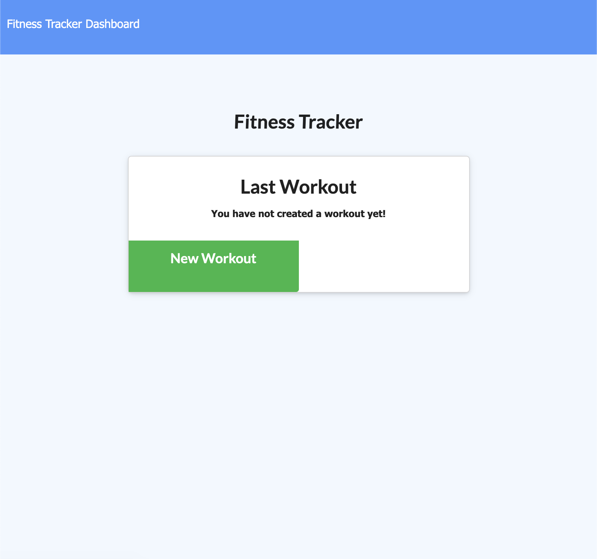
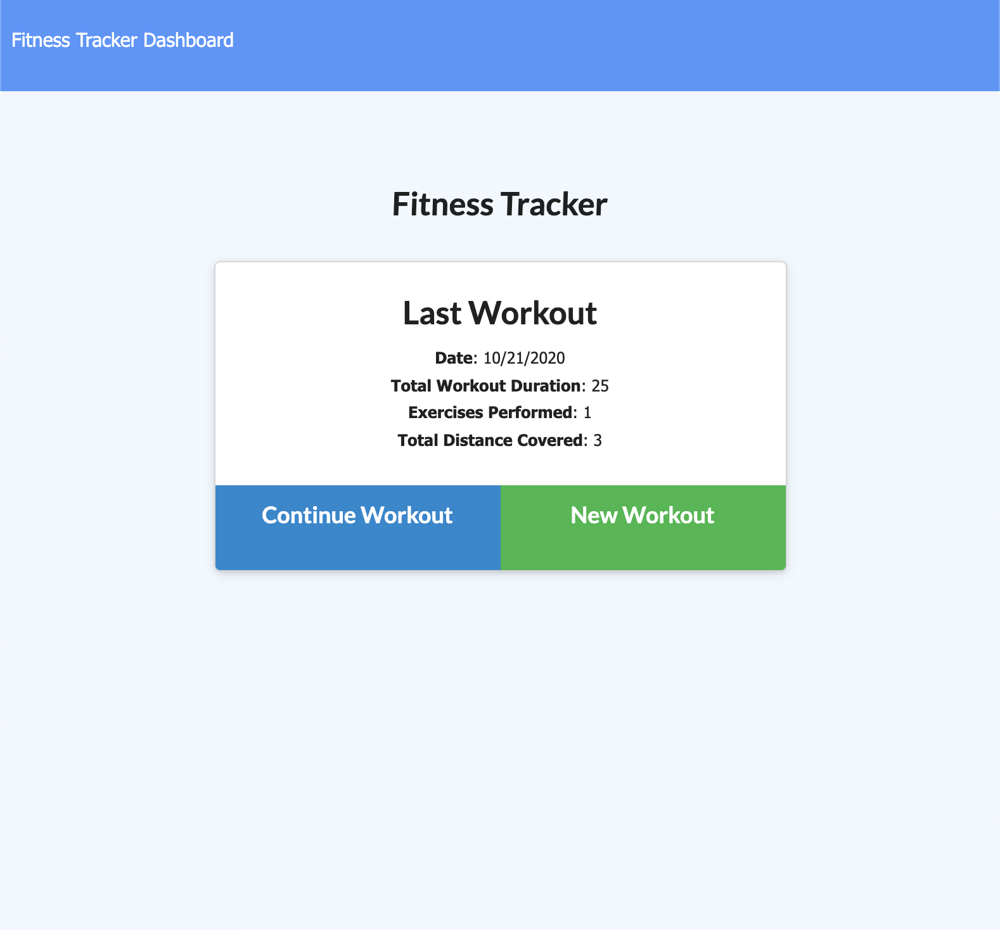
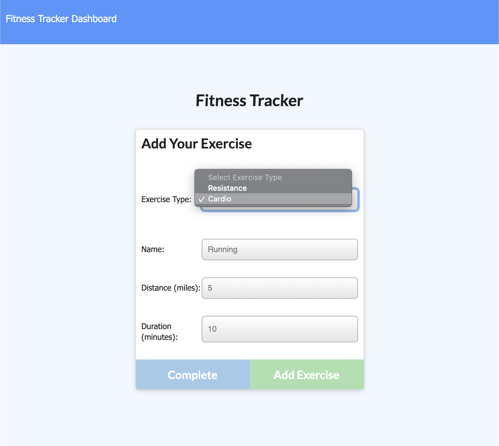
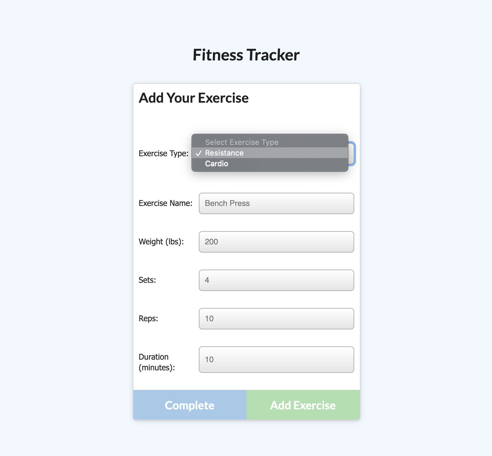
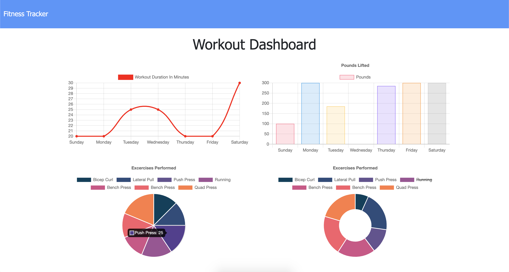

# Workout Tracker
[](https://opensource.org/licenses/MIT)

## Table of Contents
* [Description](#description)
* [Installation](#installation)
* [Technologies Used](#technologies-used)
* [Application Demo](#application-demo)
* [Contact Information](#contact-information)

## Description
This workout tracker application will allow users to create and track their daily workouts as we could all use a little reminder to stay on track! Users can log multiple exercises per workout, tracking each exercise's name, type, weight, sets, reps, and duration. For cardio workouts, users can track the distance travelled for consistency and self-betterment.

## Installation
This application is deployed on [Heroku](https://blooming-island-78923.herokuapp.com/) so that users can start tracking their workouts right away.

Alternatively, users may clone this repository and use the following command to make begin the application, entering it in an integrated terminal within the main directory:

* ```npm install```

After installing the NPM packages associated with this command (express, mongoose, and morgan), in the same integrated terminal, users should enter:

* ```node server.js```

This final command will make the app listen on the LocalHost PORT.

If following these commands, users should open their own browsers and go the following address to see the deployed application:

> localhost:3000

## Technologies Used
HTML, CSS, JavaScript, Node.js, Express.js, MongoDB, Mongoose, Morgan

## Application Demo
When starting the application for the first time, users will see a screen without any workout information, prompting users with the sole option to create a new workout:



However, when users create a workout with various exercises, they will see a screen allowing them to view stats from their last workout and the options to either *"Continue Workout"* by adding more exercises to their last workout or *"New Workout"* to begin a completely new workout:



If users click *"Continue Workout,"* they will be taken to a page to add an exercise to their workout--either resistance or cardio--with the specifications they choose for each. Clicking *"Complete"* will take the users back to the homepage; clicking *"Add Exercise"* will allow users to continue adding to the same workout:



If users click *"New Workout,"* users will be able to create an entirely new workout that will register as a new entry in the database, keeping the data straight-forward for busy people! Much like the *"Continue Workout"* button, users have the option to click *"Complete"* after adding their exercise, bringing them back to the homepage, or clicking *"Add Exercise,"* which will allow them to add another exercise to fit within this one workout in the database:



After entering a few exercises, users may choose to select the **Dashboard** option from the Navigation Bar to see their Workout Dashboard, showing workout durations per day (illustrated underneath by a pie chart breakdown) as well as the pounds lifted per day (illustrated underneath by a doughnut graph):



In addition to its being deployed on Heroku, here is a GIF showing the app's full functionality:


## Contact Information
* Jarrod Bataille
  * Portfolio Webpage: https://jtbataille.github.io/
  * GitHub Profile: https://github.com/jtbataille
  * E-mail Address: jtbataille@gmail.com